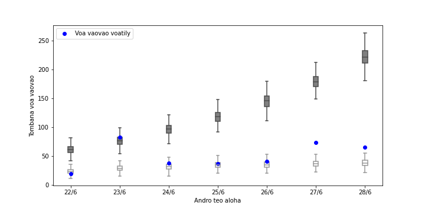
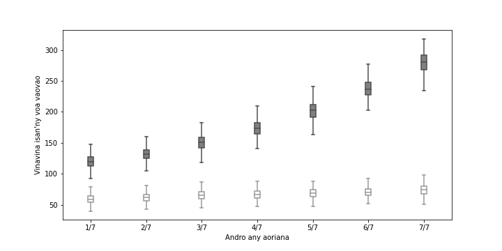
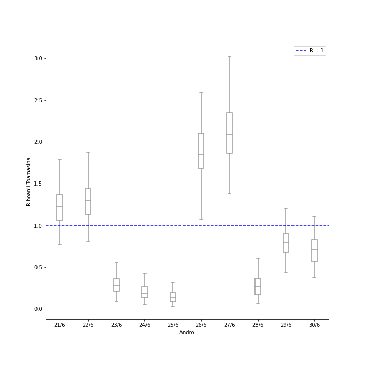
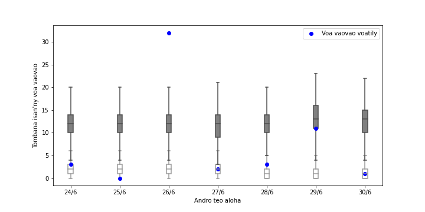
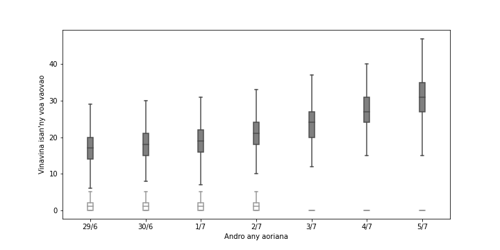

# Tabilao ankapobeny sy modely ijerena ny fivoaran'ny Covid-19 ao Madagasikara

### Fanadihadiana an-tsary

Antontanin'isa ao Madagasikara

Ao Antananarivo (ny isa hoan'ny 26/06 dia tombana)

Ao Toamasina (ny isa hoan'ny 26/06 dia tombana)

Tombana hoan'ny 10 andro teo aloha ao Antananarivo.

Jeritodika hoan'ny 7 andro teo aloha ao Antananarivo.

Vinavina hoan'ny isan'ny voa vaovao ao Antananarivo.

Tombana hoan'ny 10 andro teo aloha ao Toamasina.

Jeritodika hoan'ny 7 andro teo aloha ao Toamasina.

Vinavina hoan'ny isan'ny voa vaovao ao Toamasina.

