[Naoty fanadihadina hafa](./pejynaoty.md).

# Tabilao ankapobeny sy modely ijerena ny fivoaran'ny Covid-19 ao Madagasikara (31/07/2021)

### Fanadihadiana an-tsary hoan'Analamanga, Matsiatra Ambony sy Vakinakaratra. 

Antontanin'isa ao Madagasikara

Fampitahana taha fitrangana anaty 7 andro mifanarakaraka (7-day incidence proportion)

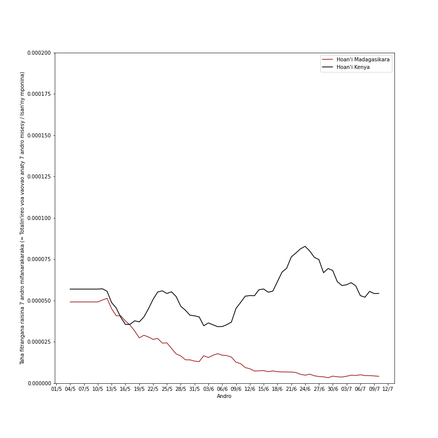

Fampitahana tahan'ny nodimandry hatrizay oharina amin'ny isan'ny voa hatrizay

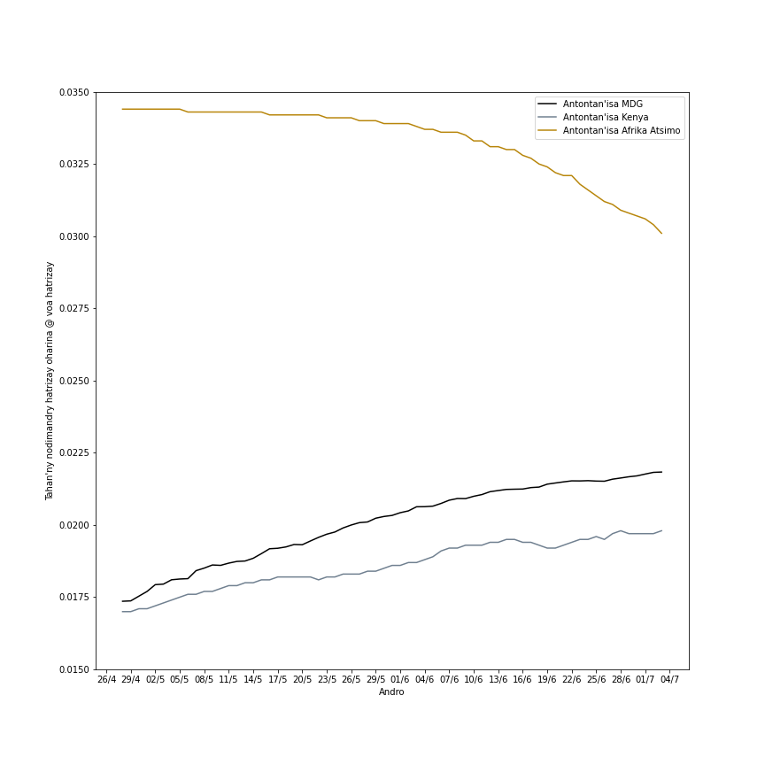

Fampitahana ny isan'ireo fahasarotana izao

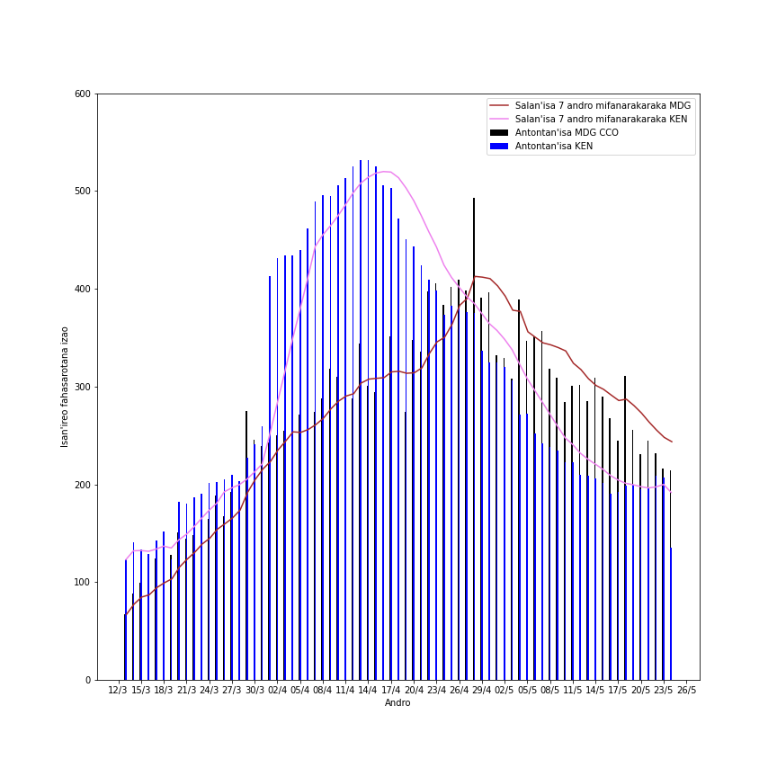

Fampitahana ny tahan'ny tahan'ny sitrana hatrizay oharina amin'ny isan'ny voa hatrizay ao Madagasikara araky ny Ministeran'ny Fahasalamam-bahoaka sy ny Worldometer

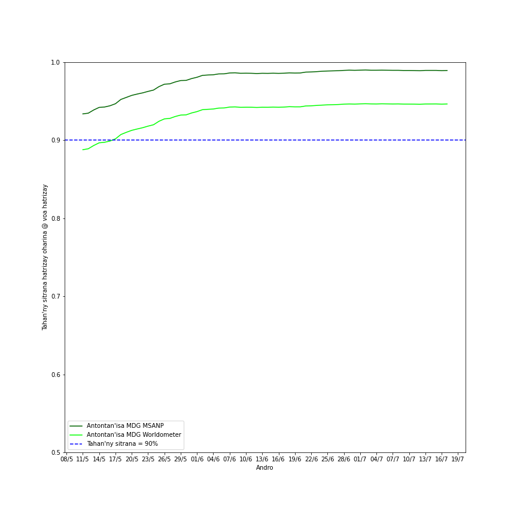

Fampitahana tahan'ny sitrana hatrizay oharina amin'ny isan'ny voa hatrizay

Fampitahana ny isan'ireo mbola voa izao araky ny Ministeran'ny Fahasalamam-bahoaka sy ny Worldometer

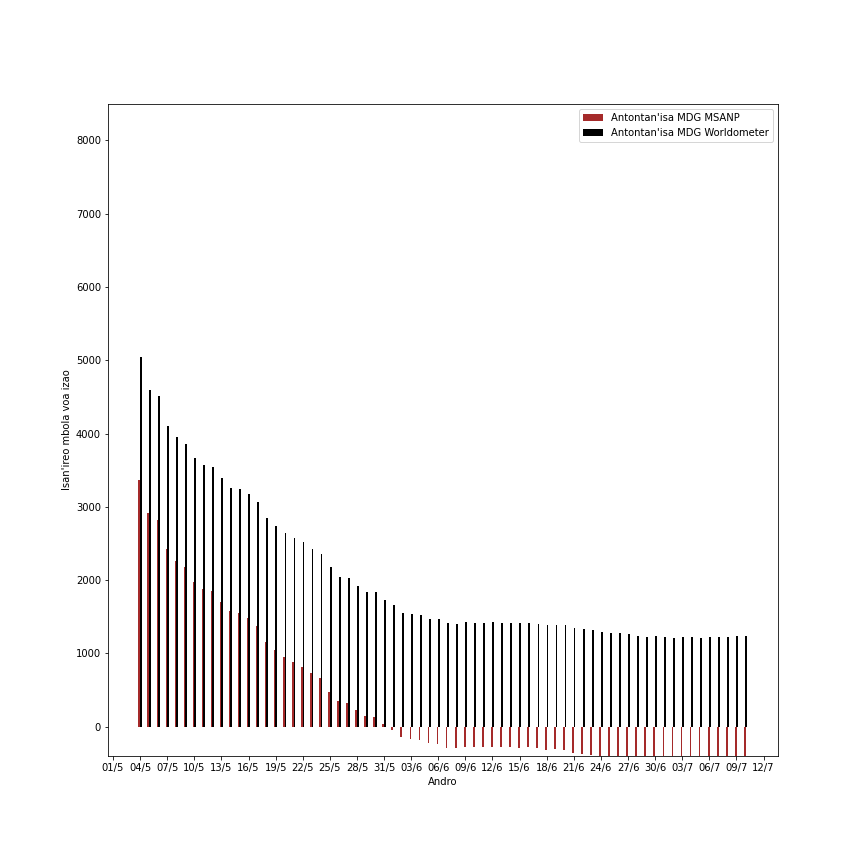

**Ao Analamanga**

**A. Tombana hoan'ny 10 andro teo aloha ao Analamanga.**

A.1. Miainga amin'ireo isan'ny voa vaovao isan'andro:

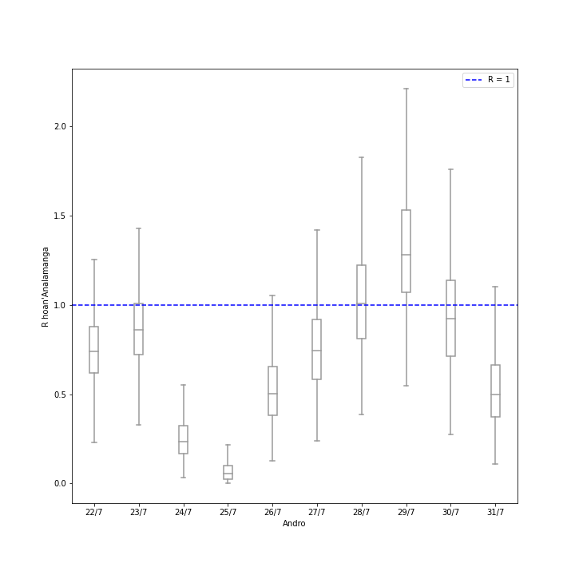

A.2. Miainga amin'ireo salan'isan'ny voa vaovao mandritra ny 7 andro mifanarakaraka:

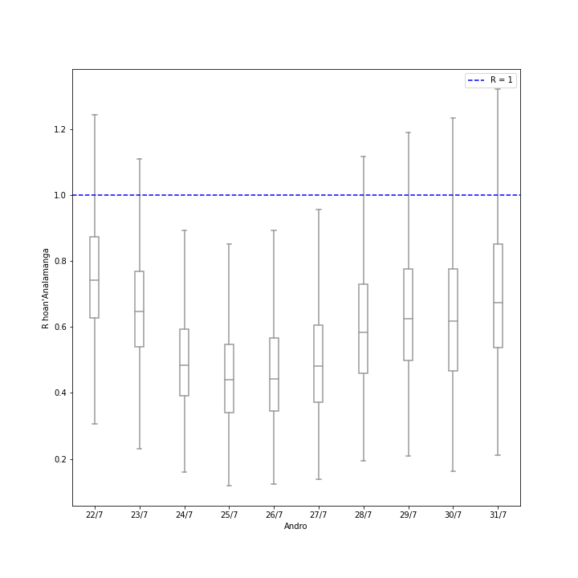

**B. Jeritodika hoan'ny 7 andro teo aloha ao Analamanga.**

B.1. Miainga amin'ireo isan'ny voa vaovao isan'andro:

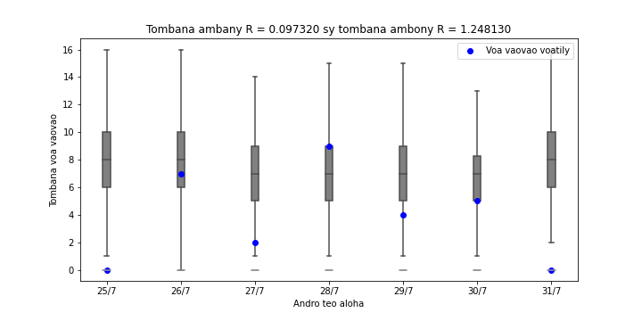

B.2. Miainga amin'ireo salan'isan'ny voa vaovao mandritra ny 7 andro mifanarakaraka:

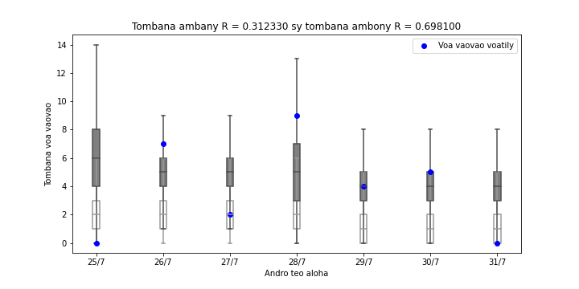

**C. Vinavina hoan'ny isan'ny voa vaovao ao Analamanga.**

C.1. Miainga amin'ireo isan'ny voa vaovao isan'andro:

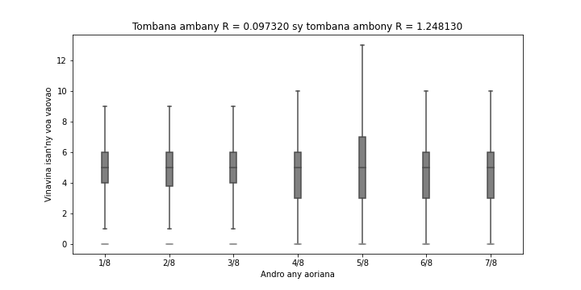

C.2. Miainga amin'ireo salan'isan'ny voa vaovao mandritra ny 7 andro mifanarakaraka:

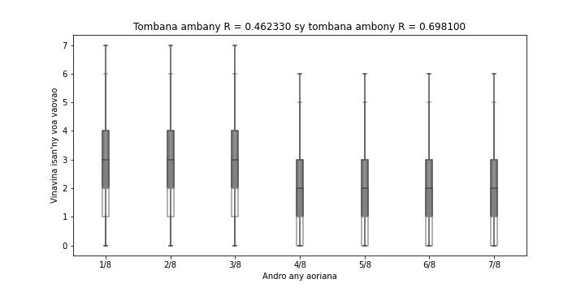

**Ao Matsiatra Ambony**

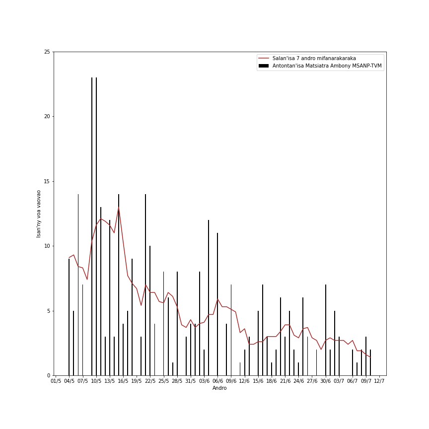

**A. Tombana hoan'ny 10 andro teo aloha ao Matsiatra Ambony.**

A.1. Miainga amin'ireo isan'ny voa vaovao isan'andro:

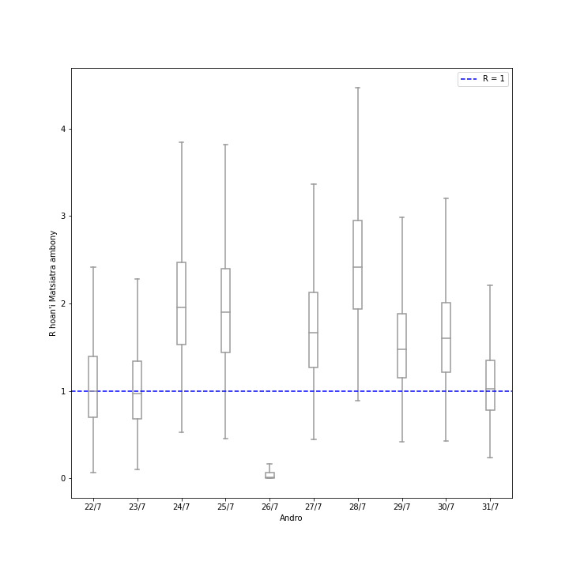

A.2. Miainga amin'ireo salan'isan'ny voa vaovao mandritra ny 7 andro mifanarakaraka:

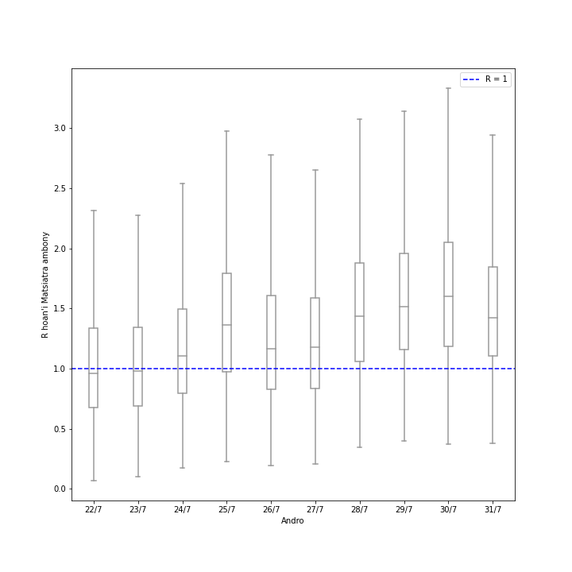

**B. Jeritodika hoan'ny 7 andro teo aloha ao Matsiatra Ambony.**

B.1. Miainga amin'ireo isan'ny voa vaovao isan'andro:

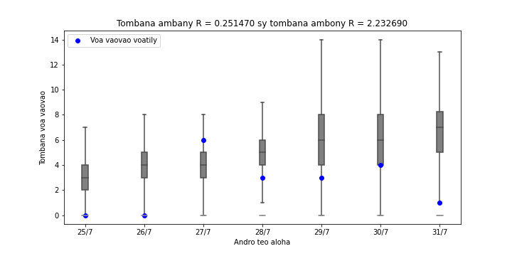

B.2. Miainga amin'ireo salan'isan'ny voa vaovao mandritra ny 7 andro mifanarakaraka:

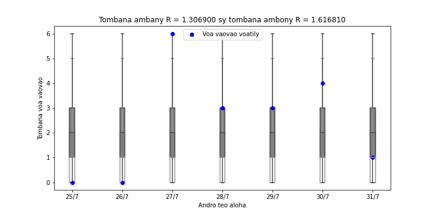

**C. Vinavina hoan'ny isan'ny voa vaovao ao Matsiatra Ambony.**

C.1. Miainga amin'ireo isan'ny voa vaovao isan'andro:

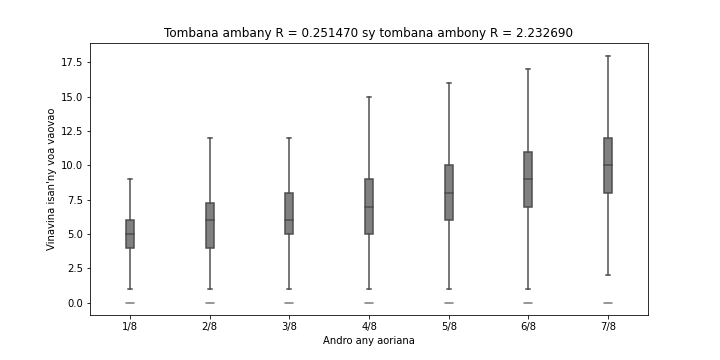

C.2. Miainga amin'ireo salan'isan'ny voa vaovao mandritra ny 7 andro mifanarakaraka:

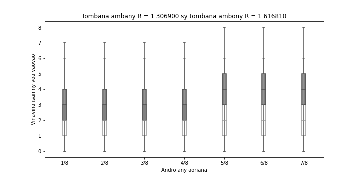

**Ao Vakinakaratra**

**A. Tombana hoan'ny 10 andro teo aloha ao Vakinakaratra.** 

A.1. Miainga amin'ireo isan'ny voa vaovao isan'andro:

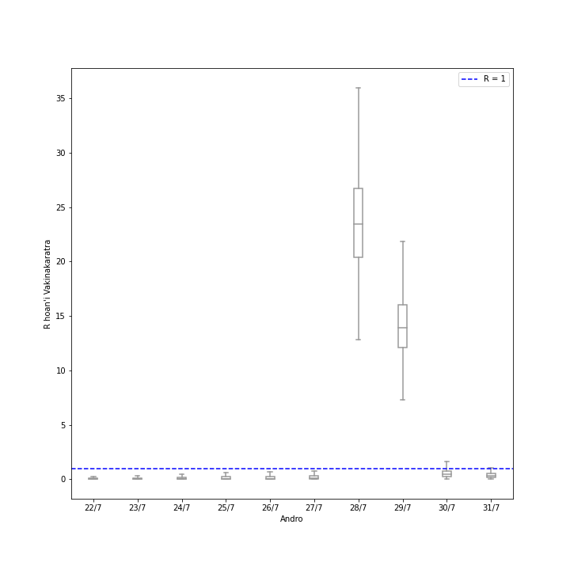

A.2. Miainga amin'ireo salan'isan'ny voa vaovao mandritra ny 7 andro mifanarakaraka:

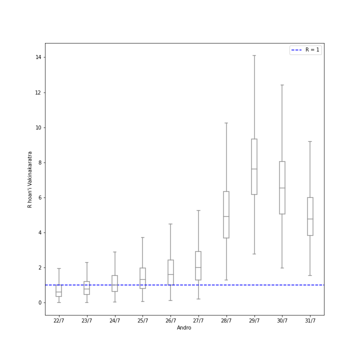

**B. Jeritodika hoan'ny 7 andro teo aloha ao Vakinakaratra.** 

<!-- Miainga amin'ireo isan'ny voa vaovao isan'andro: -->

<!-- 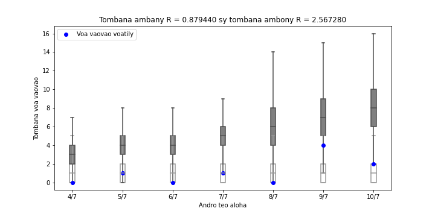  -->

Miainga amin'ireo salan'isan'ny voa vaovao mandritra ny 7 andro mifanarakaraka:

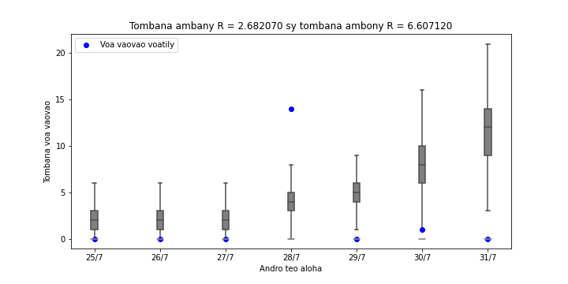 

**C. Vinavina hoan'ny isan'ny voa vaovao ao Vakinakaratra.** 

<!-- Miainga amin'ireo isan'ny voa vaovao isan'andro: -->

<!--   -->

Miainga amin'ireo salan'isan'ny voa vaovao mandritra ny 7 andro mifanarakaraka:

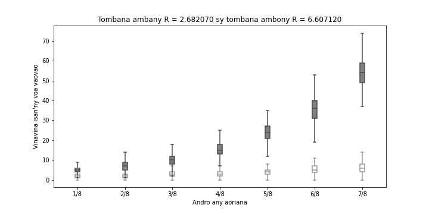

<!-- 
Ao Diana

Tombana hoan'ny 10 andro teo aloha ao Diana.
Miainga amin'ireo isan'ny voa vaovao isan'andro:

Miainga amin'ireo salan'isan'ny voa vaovao mandritra ny 7 andro mifanarakaraka:

Jeritodika hoan'ny 7 andro teo aloha ao Diana.
Miainga amin'ireo isan'ny voa vaovao isan'andro:

Miainga amin'ireo salan'isan'ny voa vaovao mandritra ny 7 andro mifanarakaraka:

Vinavina hoan'ny isan'ny voa vaovao ao Diana.
Miainga amin'ireo isan'ny voa vaovao isan'andro:

Miainga amin'ireo salan'isan'ny voa vaovao mandritra ny 7 andro mifanarakaraka:
 
Ao Boeny

Tombana hoan'ny 10 andro teo aloha ao Boeny. 
Miainga amin'ireo isan'ny voa vaovao isan'andro:

Miainga amin'ireo salan'isan'ny voa vaovao mandritra ny 7 andro mifanarakaraka:

Jeritodika hoan'ny 7 andro teo aloha ao Boeny. 
-->
<!--  -->
<!--
Miainga amin'ireo salan'isan'ny voa vaovao mandritra ny 7 andro mifanarakaraka:
 
Vinavina hoan'ny isan'ny voa vaovao ao Boeny. 
-->
<!--  -->
<!--
Miainga amin'ireo salan'isan'ny voa vaovao mandritra ny 7 andro mifanarakaraka:
 
-->

<!--

**Ao Vatovavy Fitovinany**

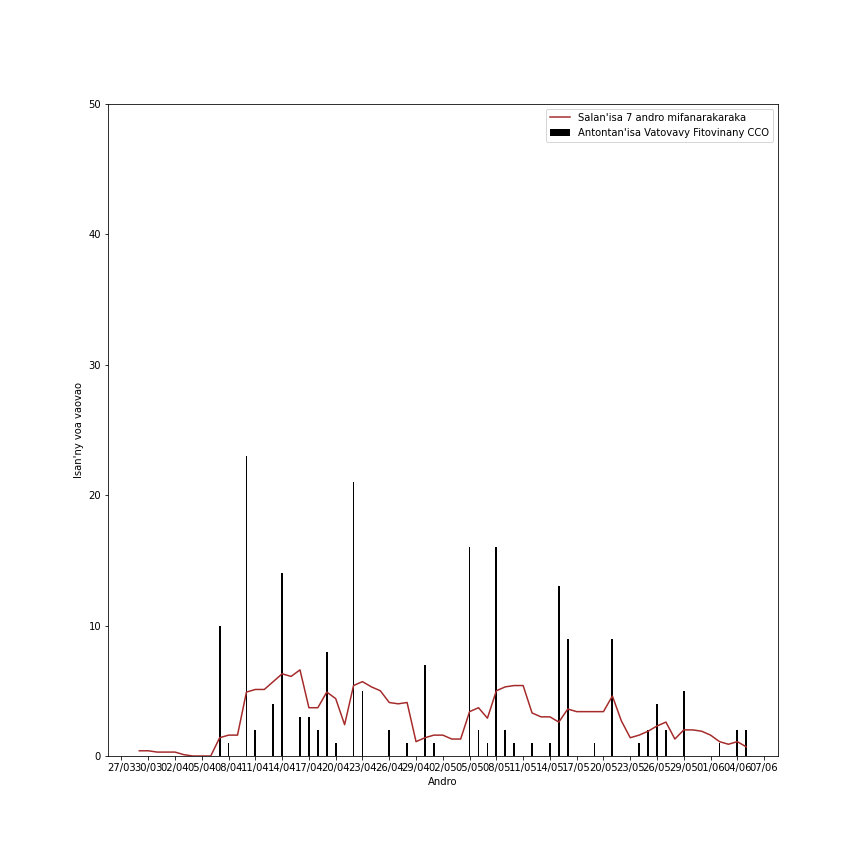

**A. Tombana hoan'ny 10 andro teo aloha ao Vatovavy Fitovinany.**

Miainga amin'ireo salan'isan'ny voa vaovao mandritra ny 7 andro mifanarakaraka:

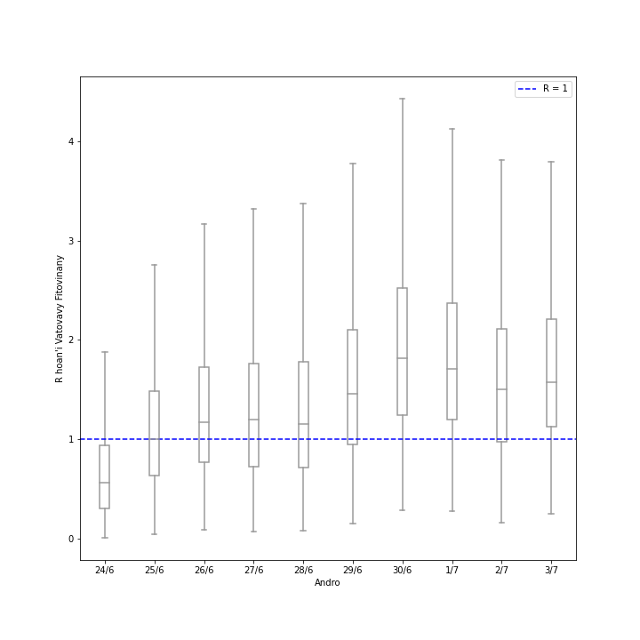

**B. Jeritodika hoan'ny 7 andro teo aloha ao Vatovavy Fitovinany.**

Miainga amin'ireo salan'isan'ny voa vaovao mandritra ny 7 andro mifanarakaraka:

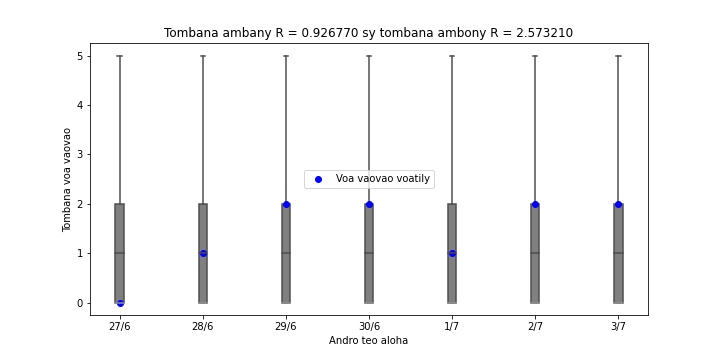

**C. Vinavina hoan'ny isan'ny voa vaovao ao Vatovavy Fitovinany.**

Miainga amin'ireo salan'isan'ny voa vaovao mandritra ny 7 andro mifanarakaraka:
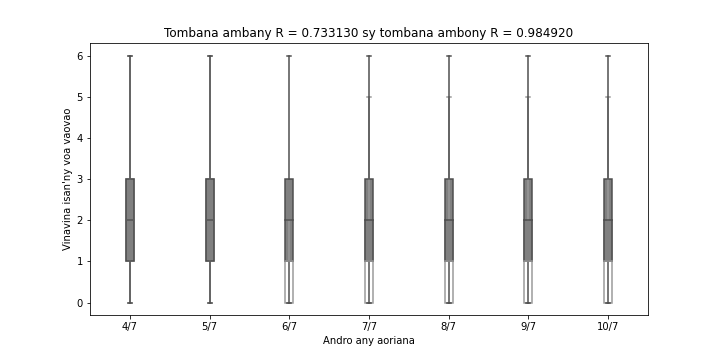

**Ao amin'ny Faritra Atsinanana**

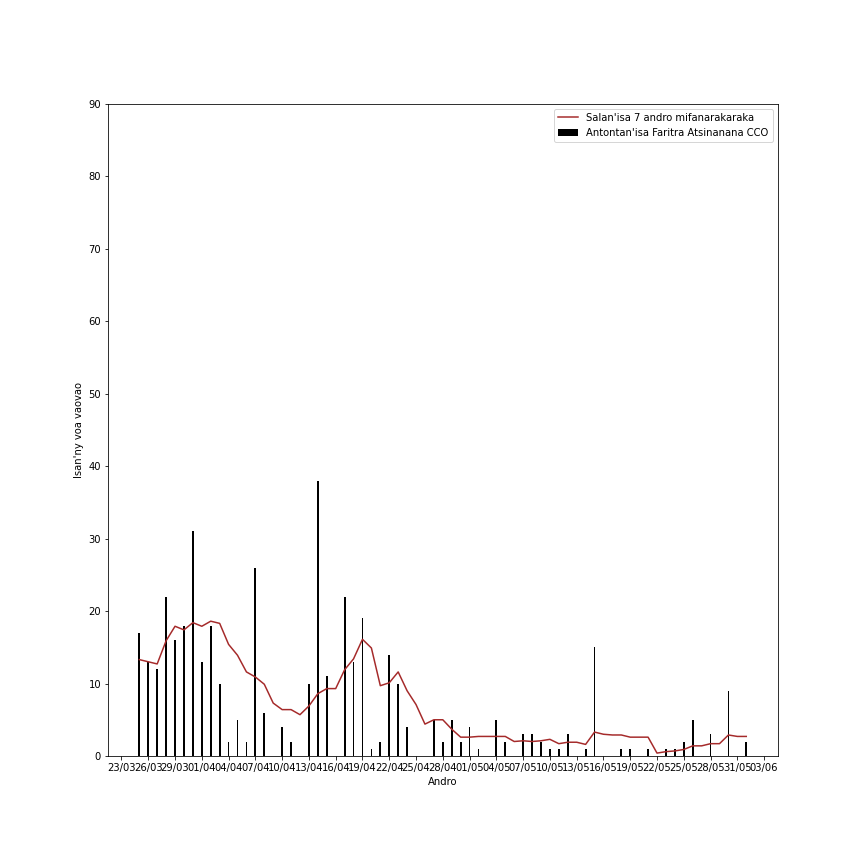

**A. Tombana hoan'ny 10 andro teo aloha ao Faritra Atsinanana.**

A.1. Miainga amin'ireo isan'ny voa vaovao isan'andro:

A.2. Miainga amin'ireo salan'isan'ny voa vaovao mandritra ny 7 andro mifanarakaraka:

**B. Jeritodika hoan'ny 7 andro teo aloha ao Faritra Atsinanana.**

B.1. Miainga amin'ireo isan'ny voa vaovao isan'andro:

B.2. Miainga amin'ireo salan'isan'ny voa vaovao mandritra ny 7 andro mifanarakaraka:

**C. Vinavina hoan'ny isan'ny voa vaovao ao Faritra Atsinanana.**

C.1. Miainga amin'ireo isan'ny voa vaovao isan'andro:

C.2. Miainga amin'ireo salan'isan'ny voa vaovao mandritra ny 7 andro mifanarakaraka:

**Ao Atsimo Andrefana**

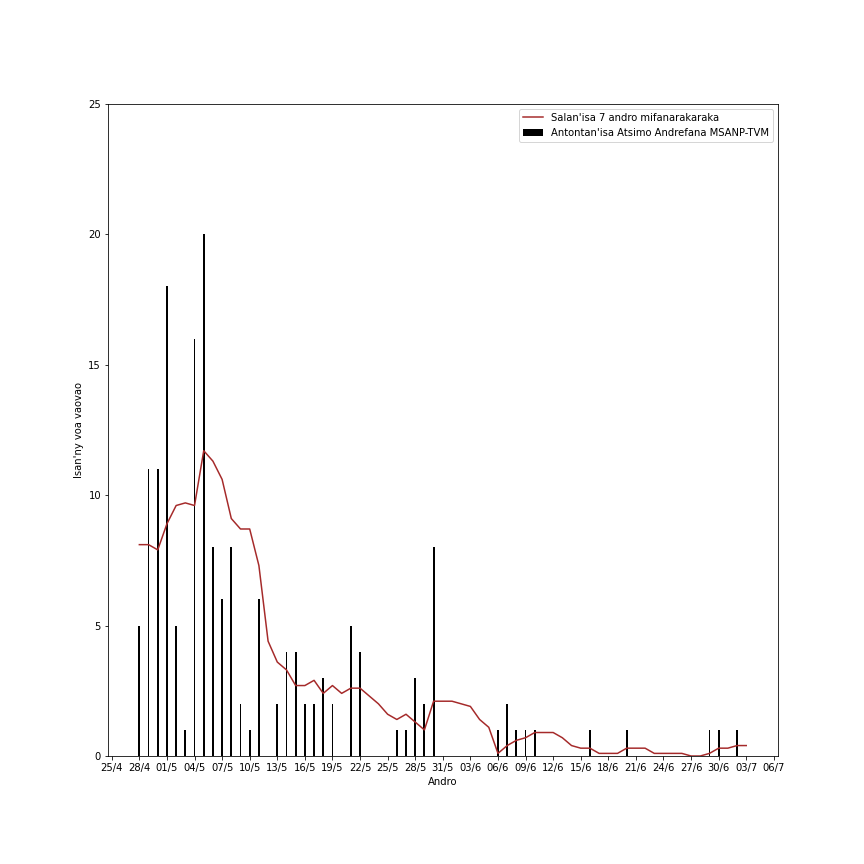

**A. Tombana hoan'ny 10 andro teo aloha ao Atsimo Andrefana.**

A.1. Miainga amin'ireo isan'ny voa vaovao isan'andro:

A.2. Miainga amin'ireo salan'isan'ny voa vaovao mandritra ny 7 andro mifanarakaraka:

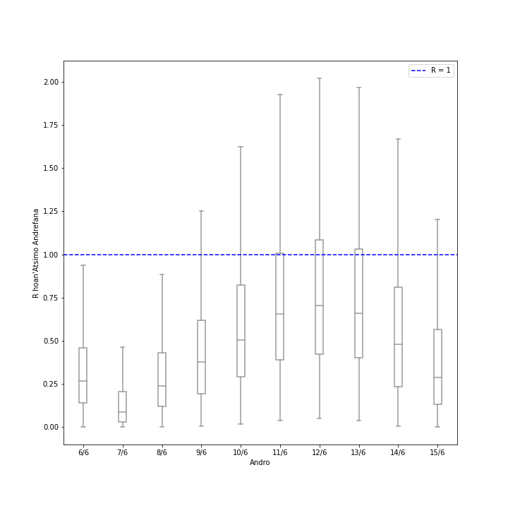

**B. Jeritodika hoan'ny 7 andro teo aloha ao Atsimo Andrefana.**

B.1. Miainga amin'ireo isan'ny voa vaovao isan'andro:
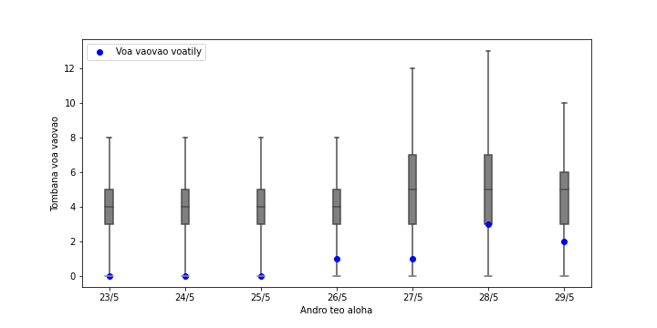

Miainga amin'ireo salan'isan'ny voa vaovao mandritra ny 7 andro mifanarakaraka:

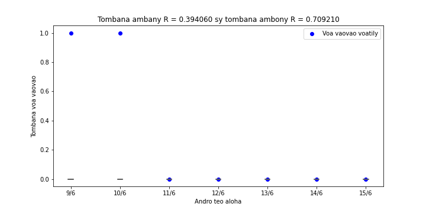

**C. Vinavina hoan'ny isan'ny voa vaovao ao Atsimo Andrefana.**

C.1. Miainga amin'ireo isan'ny voa vaovao isan'andro:
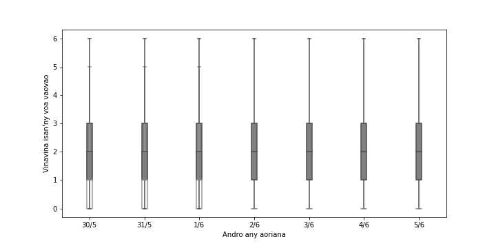

Miainga amin'ireo salan'isan'ny voa vaovao mandritra ny 7 andro mifanarakaraka:

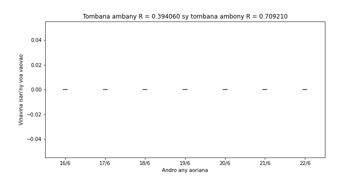

**Ao Bongolava**

**A. Tombana hoan'ny 10 andro teo aloha ao Bongolava.**

Miainga amin'ireo salan'isan'ny voa vaovao mandritra ny 7 andro mifanarakaraka:

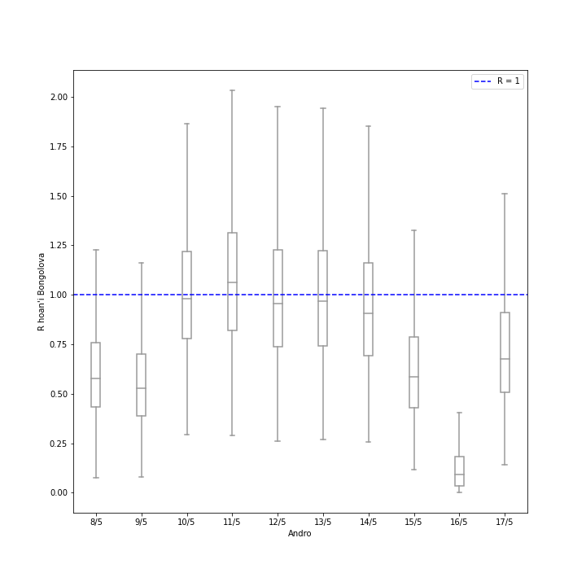

**B. Jeritodika hoan'ny 7 andro teo aloha ao Bongolava.**

B.1. Miainga amin'ireo isan'ny voa vaovao isan'andro:

Miainga amin'ireo salan'isan'ny voa vaovao mandritra ny 7 andro mifanarakaraka:

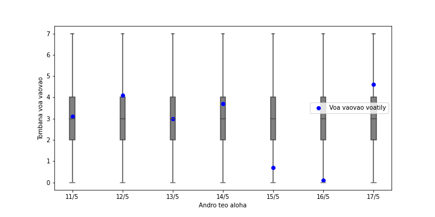

**C. Vinavina hoan'ny isan'ny voa vaovao ao Bongolava.**

<!--
C.1. Miainga amin'ireo isan'ny voa vaovao isan'andro:

Miainga amin'ireo salan'isan'ny voa vaovao mandritra ny 7 andro mifanarakaraka:

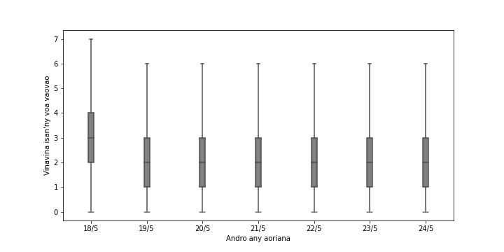

**Ao Anosy**

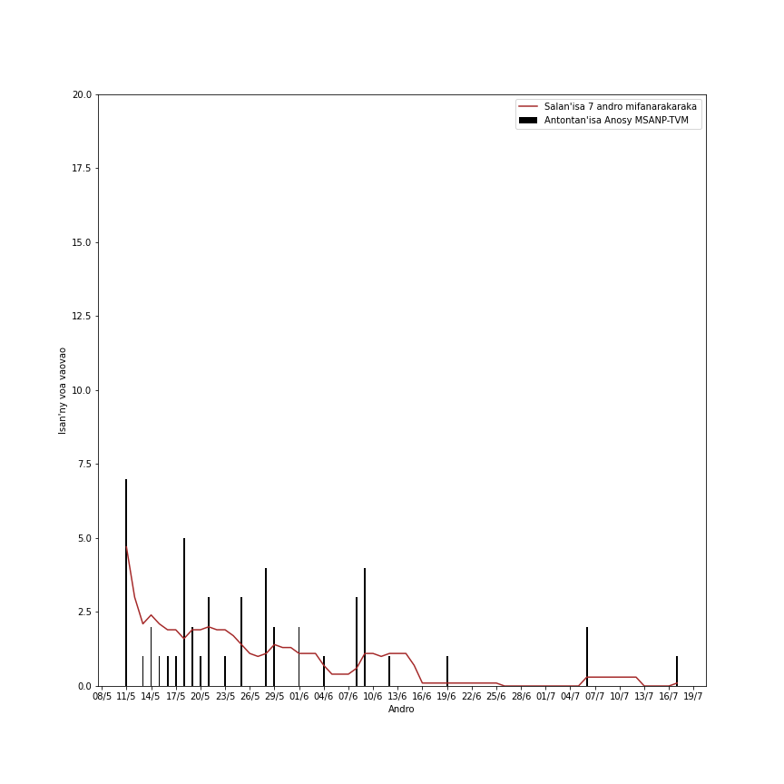

**A. Tombana hoan'ny 10 andro teo aloha ao Anosy.** 

A.1. Miainga amin'ireo isan'ny voa vaovao isan'andro:
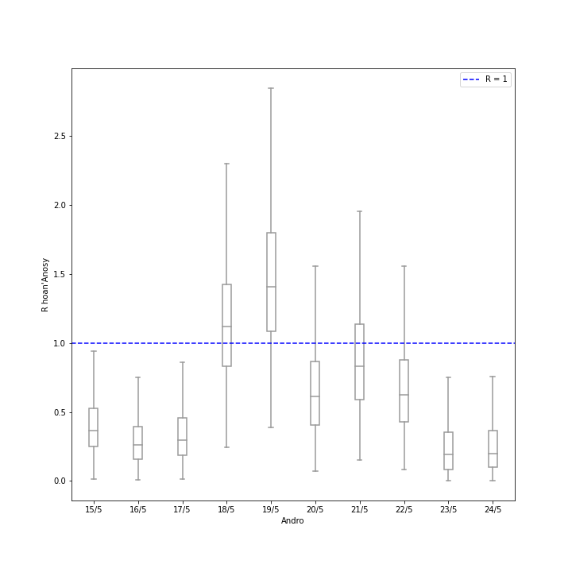

A.2. Miainga amin'ireo salan'isan'ny voa vaovao mandritra ny 7 andro mifanarakaraka:

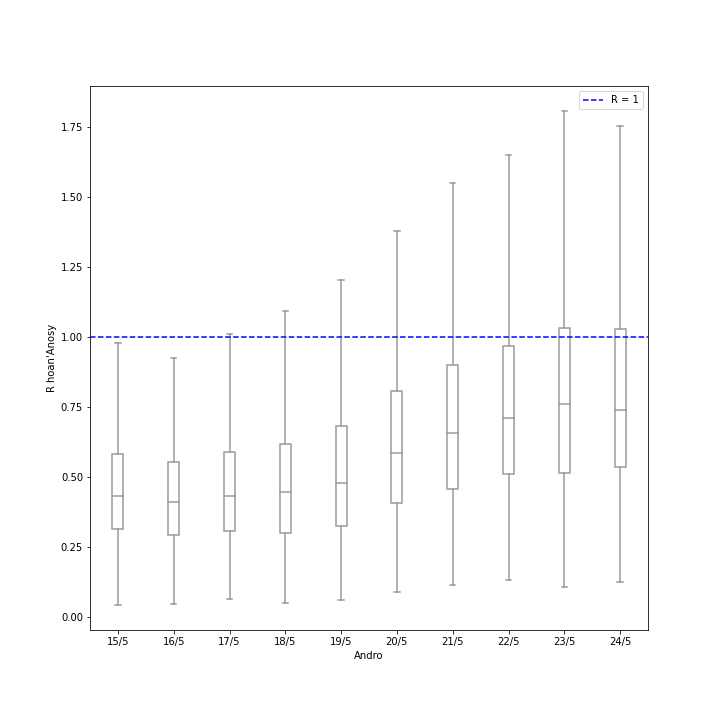

**B. Jeritodika hoan'ny 7 andro teo aloha ao Anosy.** 

Miainga amin'ireo salan'isan'ny voa vaovao mandritra ny 7 andro mifanarakaraka:

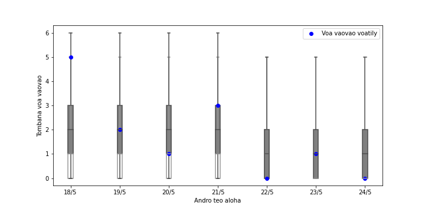 

**C. Vinavina hoan'ny isan'ny voa vaovao ao Anosy.** 

Miainga amin'ireo isan'ny voa vaovao isan'andro: 

 

Miainga amin'ireo salan'isan'ny voa vaovao mandritra ny 7 andro mifanarakaraka:

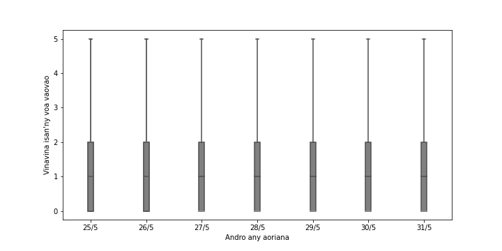

**Ao Aloatra Mangoro**

**A. Tombana hoan'ny 10 andro teo aloha ao Aloatra Mangoro.**

A.1. Miainga amin'ireo isan'ny voa vaovao isan'andro:

A.2. Miainga amin'ireo salan'isan'ny voa vaovao mandritra ny 7 andro mifanarakaraka:

**B. Jeritodika hoan'ny 7 andro teo aloha ao Aloatra Mangoro.**

B.1. Miainga amin'ireo isan'ny voa vaovao isan'andro:

B.2. Miainga amin'ireo salan'isan'ny voa vaovao mandritra ny 7 andro mifanarakaraka:

**C. Vinavina hoan'ny isan'ny voa vaovao ao Aloatra Mangoro.**

C.1. Miainga amin'ireo isan'ny voa vaovao isan'andro:

C.2. Miainga amin'ireo salan'isan'ny voa vaovao mandritra ny 7 andro mifanarakaraka:

**Ao Menabe**

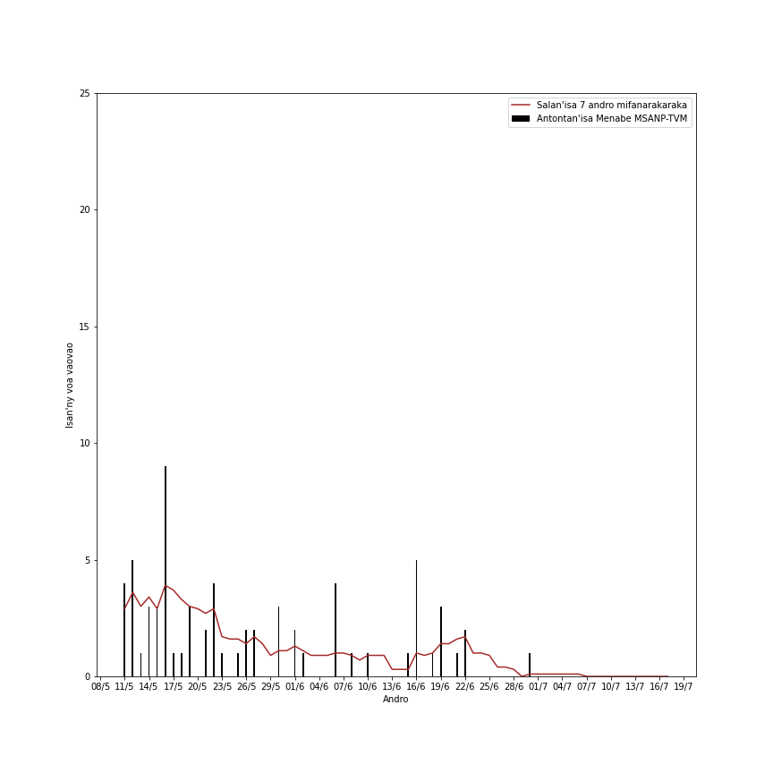

**A. Tombana hoan'ny 10 andro teo aloha ao Menabe.**

A.1. Miainga amin'ireo isan'ny voa vaovao isan'andro:

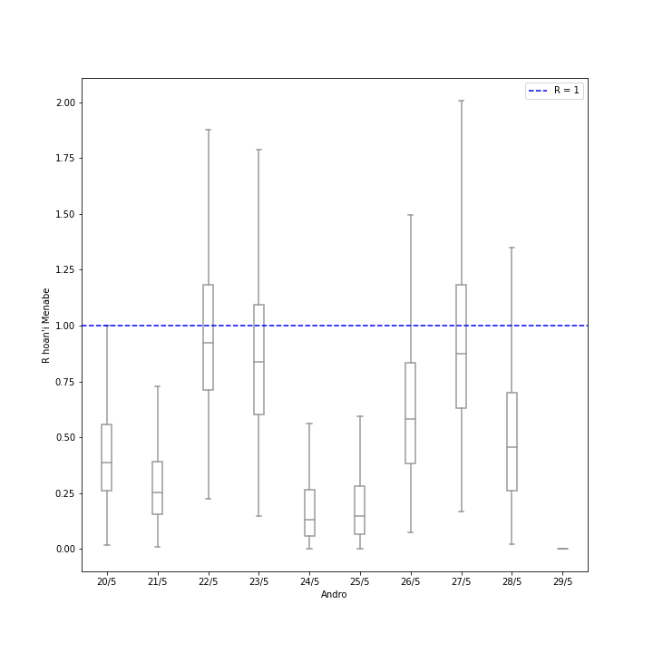

A.2. Miainga amin'ireo salan'isan'ny voa vaovao mandritra ny 7 andro mifanarakaraka:

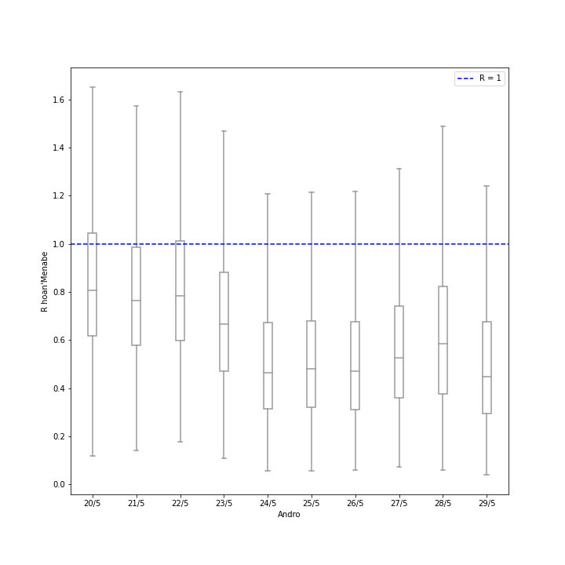

**B. Jeritodika hoan'ny 7 andro teo aloha ao Menabe.**

B.1. Miainga amin'ireo isan'ny voa vaovao isan'andro:

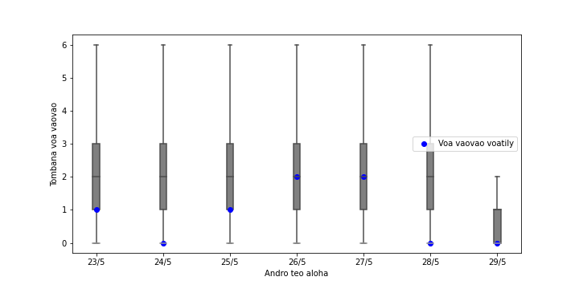

B.2. Miainga amin'ireo salan'isan'ny voa vaovao mandritra ny 7 andro mifanarakaraka:

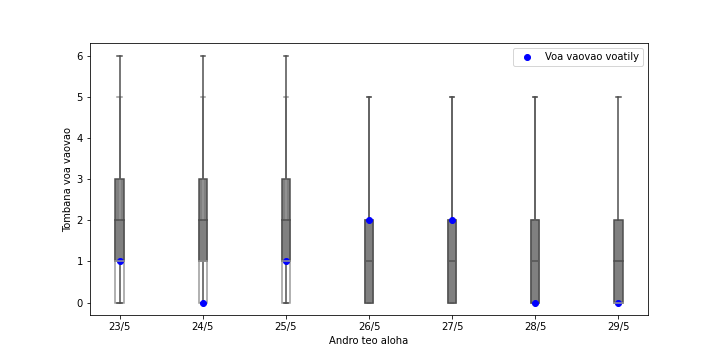

**C. Vinavina hoan'ny isan'ny voa vaovao ao Menabe.**

C.1. Miainga amin'ireo isan'ny voa vaovao isan'andro:

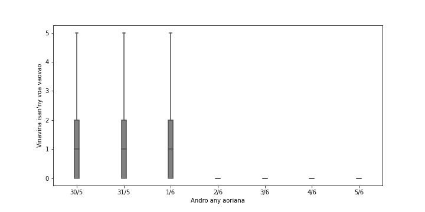

C.2. Miainga amin'ireo salan'isan'ny voa vaovao mandritra ny 7 andro mifanarakaraka:

-->
