[Naoty fanadihadina hafa](./pejynaoty.md).

# Tabilao ankapobeny sy modely ijerena ny fivoaran'ny Covid-19 ao Madagasikara (12/06/2021)

### Fanadihadiana an-tsary hoan'Analamanga, Faritra Atsinanana, Atsimo Andrefana ary Matsiatra Ambony. 

Antontanin'isa ao Madagasikara

Fampitahana taha fitrangana anaty 7 andro mifanarakaraka (7-day incidence proportion)

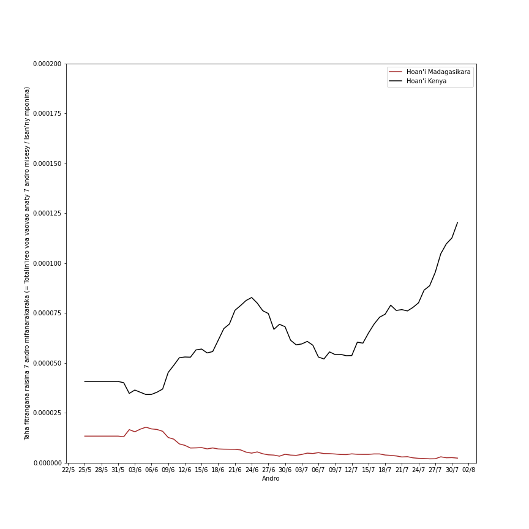

Fampitahana tahan'ny nodimandry hatrizay oharina amin'ny isan'ny voa hatrizay

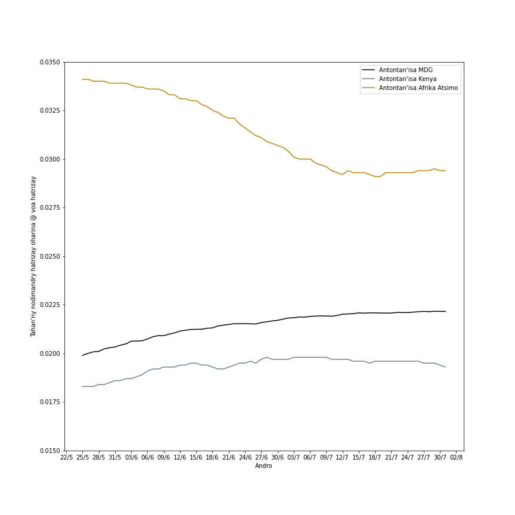

Fampitahana ny isan'ireo fahasarotana izao

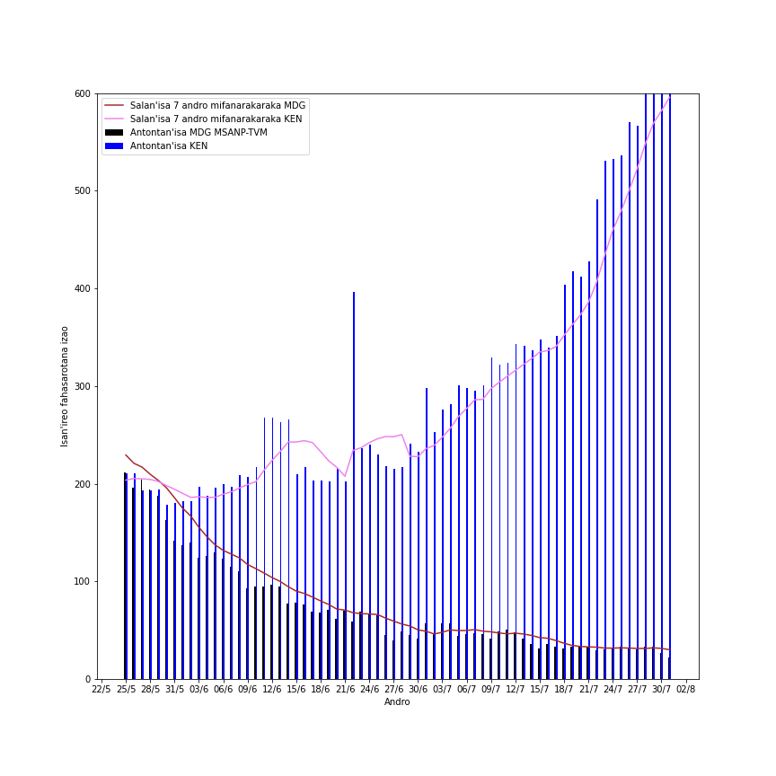

Fampitahana tahan'ny sitrana hatrizay oharina amin'ny isan'ny voa hatrizay

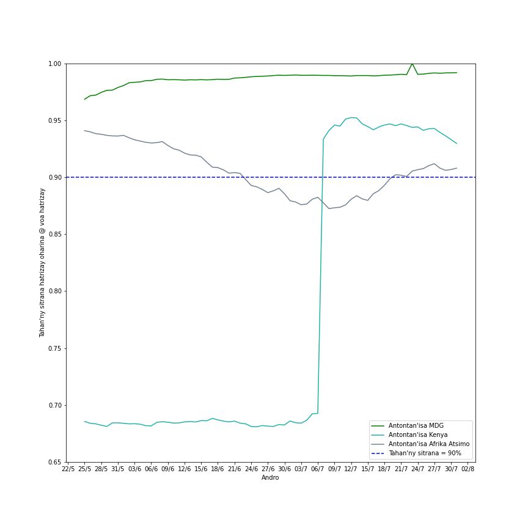

<!--
Fampitahana ny isan'ireo mbola voa izao

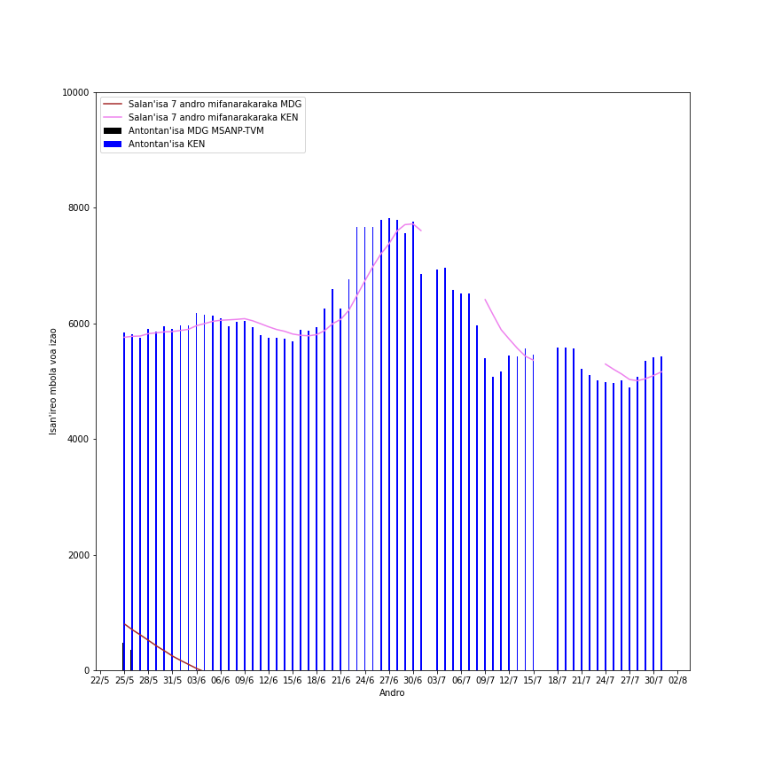

Fampitahana ny tahan'ireo manana fahasarotana izao oharina amin'ireo mbola voa izao

-->

**Ao Analamanga**

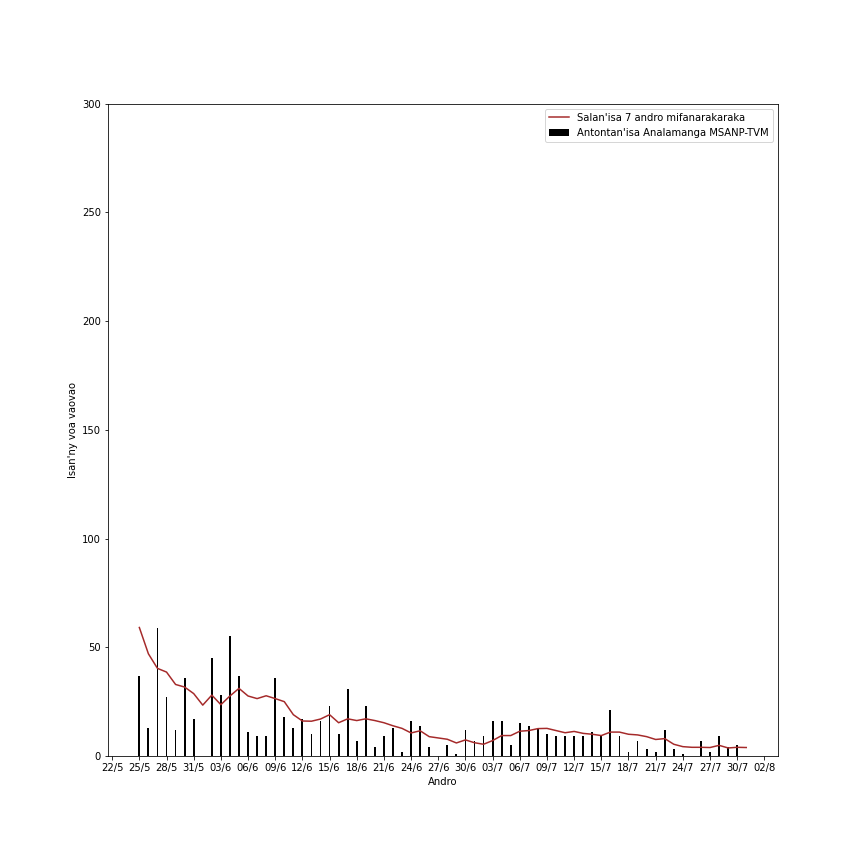

**A. Tombana hoan'ny 10 andro teo aloha ao Analamanga.**

A.1. Miainga amin'ireo isan'ny voa vaovao isan'andro:

A.2. Miainga amin'ireo salan'isan'ny voa vaovao mandritra ny 7 andro mifanarakaraka:

**B. Jeritodika hoan'ny 7 andro teo aloha ao Analamanga.**

B.1. Miainga amin'ireo isan'ny voa vaovao isan'andro:

B.2. Miainga amin'ireo salan'isan'ny voa vaovao mandritra ny 7 andro mifanarakaraka:

**C. Vinavina hoan'ny isan'ny voa vaovao ao Analamanga.**

C.1. Miainga amin'ireo isan'ny voa vaovao isan'andro:

C.2. Miainga amin'ireo salan'isan'ny voa vaovao mandritra ny 7 andro mifanarakaraka:

<!-- 
Ao Diana

Tombana hoan'ny 10 andro teo aloha ao Diana.
Miainga amin'ireo isan'ny voa vaovao isan'andro:

Miainga amin'ireo salan'isan'ny voa vaovao mandritra ny 7 andro mifanarakaraka:

Jeritodika hoan'ny 7 andro teo aloha ao Diana.
Miainga amin'ireo isan'ny voa vaovao isan'andro:

Miainga amin'ireo salan'isan'ny voa vaovao mandritra ny 7 andro mifanarakaraka:

Vinavina hoan'ny isan'ny voa vaovao ao Diana.
Miainga amin'ireo isan'ny voa vaovao isan'andro:

Miainga amin'ireo salan'isan'ny voa vaovao mandritra ny 7 andro mifanarakaraka:
 
Ao Boeny

Tombana hoan'ny 10 andro teo aloha ao Boeny. 
Miainga amin'ireo isan'ny voa vaovao isan'andro:

Miainga amin'ireo salan'isan'ny voa vaovao mandritra ny 7 andro mifanarakaraka:

Jeritodika hoan'ny 7 andro teo aloha ao Boeny. 
-->
<!--  -->
<!--
Miainga amin'ireo salan'isan'ny voa vaovao mandritra ny 7 andro mifanarakaraka:
 
Vinavina hoan'ny isan'ny voa vaovao ao Boeny. 
-->
<!--  -->
<!--
Miainga amin'ireo salan'isan'ny voa vaovao mandritra ny 7 andro mifanarakaraka:
 
-->

**Ao Atsimo Andrefana**

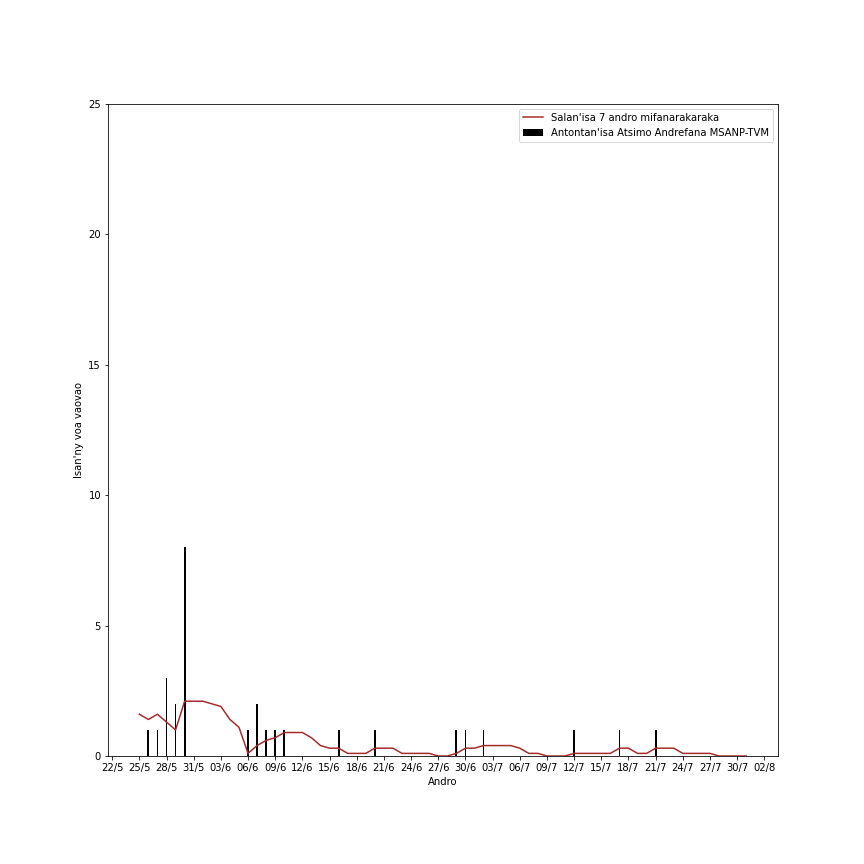

**A. Tombana hoan'ny 10 andro teo aloha ao Atsimo Andrefana.**

A.1. Miainga amin'ireo isan'ny voa vaovao isan'andro:

A.2. Miainga amin'ireo salan'isan'ny voa vaovao mandritra ny 7 andro mifanarakaraka:

**B. Jeritodika hoan'ny 7 andro teo aloha ao Atsimo Andrefana.**

<!--
B.1. Miainga amin'ireo isan'ny voa vaovao isan'andro:

-->

Miainga amin'ireo salan'isan'ny voa vaovao mandritra ny 7 andro mifanarakaraka:

**C. Vinavina hoan'ny isan'ny voa vaovao ao Atsimo Andrefana.**

<!--
C.1. Miainga amin'ireo isan'ny voa vaovao isan'andro:

-->

Miainga amin'ireo salan'isan'ny voa vaovao mandritra ny 7 andro mifanarakaraka:

**Ao Matsiatra Ambony**

**A. Tombana hoan'ny 10 andro teo aloha ao Matsiatra Ambony.**

A.1. Miainga amin'ireo isan'ny voa vaovao isan'andro:

A.2. Miainga amin'ireo salan'isan'ny voa vaovao mandritra ny 7 andro mifanarakaraka:

**B. Jeritodika hoan'ny 7 andro teo aloha ao Matsiatra Ambony.**

B.1. Miainga amin'ireo isan'ny voa vaovao isan'andro:

B.2. Miainga amin'ireo salan'isan'ny voa vaovao mandritra ny 7 andro mifanarakaraka:

**C. Vinavina hoan'ny isan'ny voa vaovao ao Matsiatra Ambony.**

C.1. Miainga amin'ireo isan'ny voa vaovao isan'andro:

C.2. Miainga amin'ireo salan'isan'ny voa vaovao mandritra ny 7 andro mifanarakaraka:

<!--

**Ao amin'ny Faritra Atsinanana**

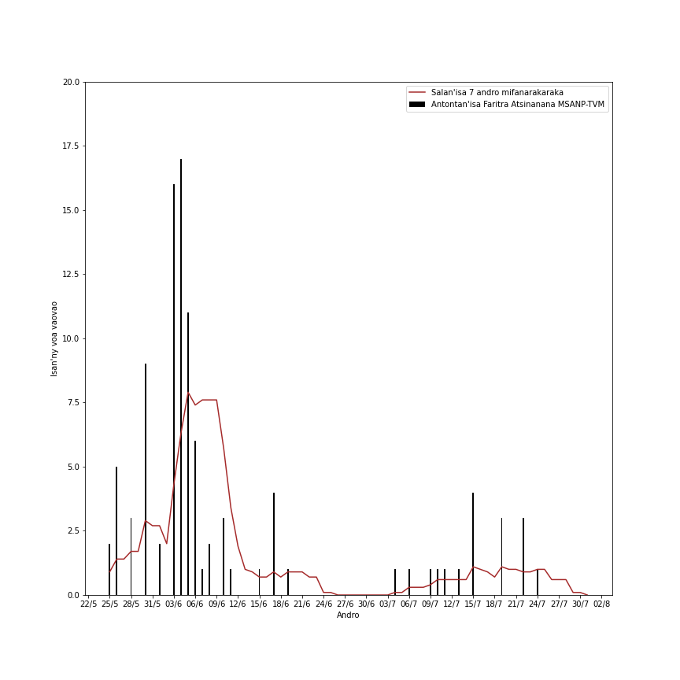

**A. Tombana hoan'ny 10 andro teo aloha ao Faritra Atsinanana.**

A.1. Miainga amin'ireo isan'ny voa vaovao isan'andro:

A.2. Miainga amin'ireo salan'isan'ny voa vaovao mandritra ny 7 andro mifanarakaraka:

**B. Jeritodika hoan'ny 7 andro teo aloha ao Faritra Atsinanana.**

B.1. Miainga amin'ireo isan'ny voa vaovao isan'andro:

B.2. Miainga amin'ireo salan'isan'ny voa vaovao mandritra ny 7 andro mifanarakaraka:

**C. Vinavina hoan'ny isan'ny voa vaovao ao Faritra Atsinanana.**

C.1. Miainga amin'ireo isan'ny voa vaovao isan'andro:

C.2. Miainga amin'ireo salan'isan'ny voa vaovao mandritra ny 7 andro mifanarakaraka:

**Ao Vakinakaratra**

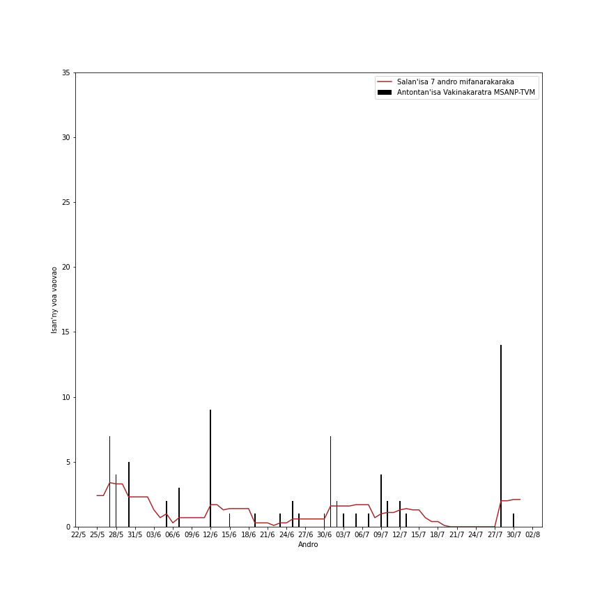

**A. Tombana hoan'ny 10 andro teo aloha ao Vakinakaratra.** 

A.1. Miainga amin'ireo isan'ny voa vaovao isan'andro:

A.2. Miainga amin'ireo salan'isan'ny voa vaovao mandritra ny 7 andro mifanarakaraka:

**B. Jeritodika hoan'ny 7 andro teo aloha ao Vakinakaratra.** 

 

Miainga amin'ireo salan'isan'ny voa vaovao mandritra ny 7 andro mifanarakaraka:

 

**C. Vinavina hoan'ny isan'ny voa vaovao ao Vakinakaratra.** 

<!-- Miainga amin'ireo isan'ny voa vaovao isan'andro: -->

<!-- 

Miainga amin'ireo salan'isan'ny voa vaovao mandritra ny 7 andro mifanarakaraka:

**Ao Vatovavy Fitovinany**

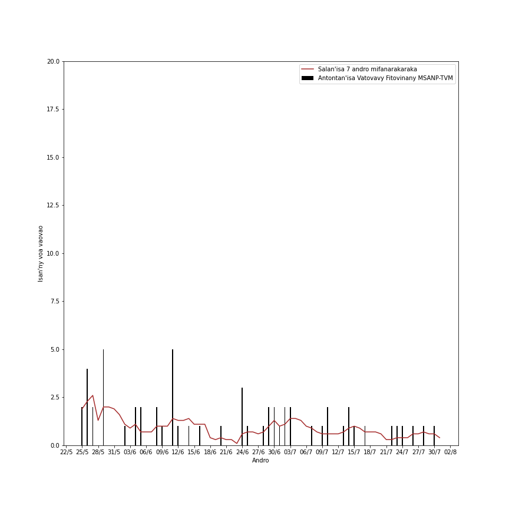

**A. Tombana hoan'ny 10 andro teo aloha ao Vatovavy Fitovinany.**

Miainga amin'ireo salan'isan'ny voa vaovao mandritra ny 7 andro mifanarakaraka:

**B. Jeritodika hoan'ny 7 andro teo aloha ao Vatovavy Fitovinany.**

<!--
B.1. Miainga amin'ireo isan'ny voa vaovao isan'andro:

Miainga amin'ireo salan'isan'ny voa vaovao mandritra ny 7 andro mifanarakaraka:

**C. Vinavina hoan'ny isan'ny voa vaovao ao Vatovavy Fitovinany.**

C.1. Miainga amin'ireo isan'ny voa vaovao isan'andro:

Miainga amin'ireo salan'isan'ny voa vaovao mandritra ny 7 andro mifanarakaraka:

**Ao Bongolava**

**A. Tombana hoan'ny 10 andro teo aloha ao Bongolava.**

Miainga amin'ireo salan'isan'ny voa vaovao mandritra ny 7 andro mifanarakaraka:

**B. Jeritodika hoan'ny 7 andro teo aloha ao Bongolava.**

B.1. Miainga amin'ireo isan'ny voa vaovao isan'andro:

Miainga amin'ireo salan'isan'ny voa vaovao mandritra ny 7 andro mifanarakaraka:

**C. Vinavina hoan'ny isan'ny voa vaovao ao Bongolava.**

<!--
C.1. Miainga amin'ireo isan'ny voa vaovao isan'andro:

Miainga amin'ireo salan'isan'ny voa vaovao mandritra ny 7 andro mifanarakaraka:

**Ao Anosy**

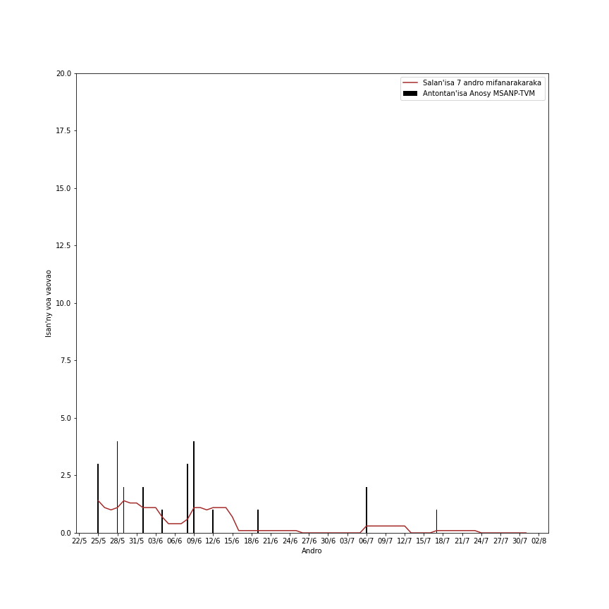

**A. Tombana hoan'ny 10 andro teo aloha ao Anosy.** 

A.1. Miainga amin'ireo isan'ny voa vaovao isan'andro:

A.2. Miainga amin'ireo salan'isan'ny voa vaovao mandritra ny 7 andro mifanarakaraka:

**B. Jeritodika hoan'ny 7 andro teo aloha ao Anosy.** 

Miainga amin'ireo salan'isan'ny voa vaovao mandritra ny 7 andro mifanarakaraka:

 

**C. Vinavina hoan'ny isan'ny voa vaovao ao Anosy.** 

Miainga amin'ireo isan'ny voa vaovao isan'andro: 

 

Miainga amin'ireo salan'isan'ny voa vaovao mandritra ny 7 andro mifanarakaraka:

**Ao Aloatra Mangoro**

**A. Tombana hoan'ny 10 andro teo aloha ao Aloatra Mangoro.**

A.1. Miainga amin'ireo isan'ny voa vaovao isan'andro:

A.2. Miainga amin'ireo salan'isan'ny voa vaovao mandritra ny 7 andro mifanarakaraka:

**B. Jeritodika hoan'ny 7 andro teo aloha ao Aloatra Mangoro.**

B.1. Miainga amin'ireo isan'ny voa vaovao isan'andro:

B.2. Miainga amin'ireo salan'isan'ny voa vaovao mandritra ny 7 andro mifanarakaraka:

**C. Vinavina hoan'ny isan'ny voa vaovao ao Aloatra Mangoro.**

C.1. Miainga amin'ireo isan'ny voa vaovao isan'andro:

C.2. Miainga amin'ireo salan'isan'ny voa vaovao mandritra ny 7 andro mifanarakaraka:

**Ao Menabe**

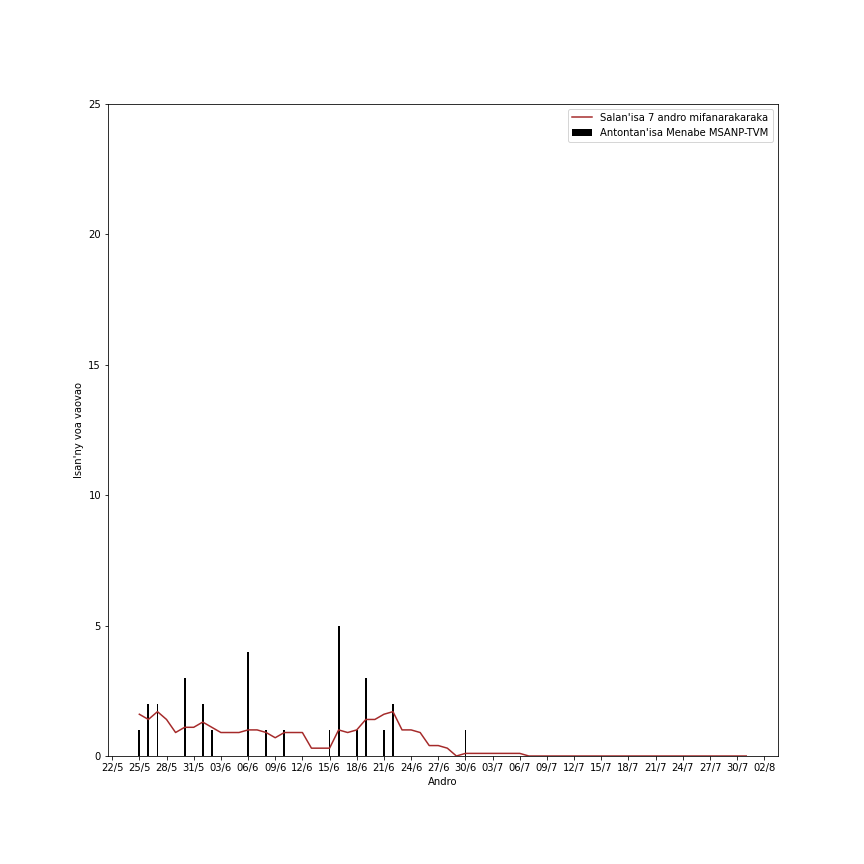

**A. Tombana hoan'ny 10 andro teo aloha ao Menabe.**

A.1. Miainga amin'ireo isan'ny voa vaovao isan'andro:

A.2. Miainga amin'ireo salan'isan'ny voa vaovao mandritra ny 7 andro mifanarakaraka:

**B. Jeritodika hoan'ny 7 andro teo aloha ao Menabe.**

B.1. Miainga amin'ireo isan'ny voa vaovao isan'andro:

B.2. Miainga amin'ireo salan'isan'ny voa vaovao mandritra ny 7 andro mifanarakaraka:

**C. Vinavina hoan'ny isan'ny voa vaovao ao Menabe.**

C.1. Miainga amin'ireo isan'ny voa vaovao isan'andro:

C.2. Miainga amin'ireo salan'isan'ny voa vaovao mandritra ny 7 andro mifanarakaraka:

-->
