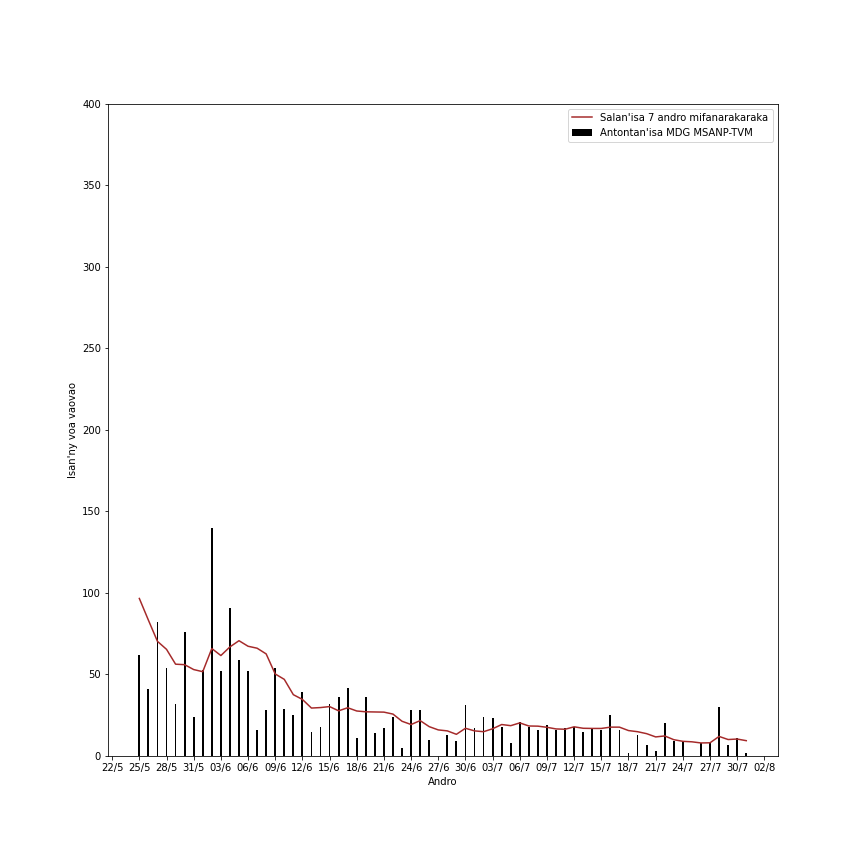

# Tabilao ankapobeny sy modely ijerena ny fivoaran'ny Covid-19 ao Madagasikara

### Fanadihadiana an-tsary

Antontanin'isa ao Madagasikara

Ao Antananarivo

Ao Toamasina

Tombana hoan'ny 10 andro teo aloha ao Antananarivo.

Tombana hoan'ny 10 andro teo aloha ao Toamasina.

Vinavina ambany hoan'ny isan'ny voa vaovao ao Antananarivo.

Vinavina ambony hoan'ny isan'ny voa vaovao ao Antananarivo.

Vinavina ambany hoan'ny isan'ny voa vaovao ao Toamasina.

Vinavina ambony hoan'ny isan'ny voa vaovao ao Toamasina.

