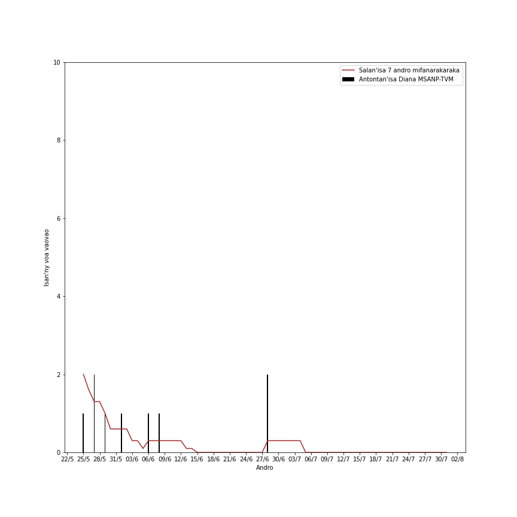
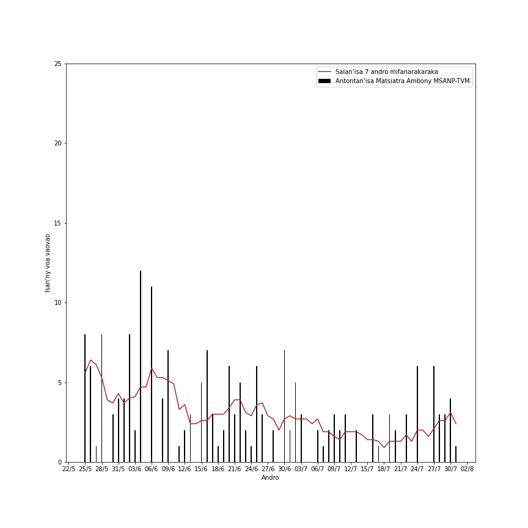

# Tabilao ankapobeny sy modely ijerena ny fivoaran'ny Covid-19 ao Madagasikara (17/05/2021)

### Fanadihadiana an-tsary hoan'Analamanga, Vakinakaratra, Alaotra Mangoro, Matsiatra Ambony, Vatovavy Fitovinany ary Bongolova

Antontanin'isa ao Madagasikara

Fampitahana taha fitrangana anaty 7 andro mifanarakaraka (7-day incidence proportion)

**Ao Analamanga**

**A. Tombana hoan'ny 10 andro teo aloha ao Analamanga.**

A.1. Miainga amin'ireo isan'ny voa vaovao isan'andro:

A.2. Miainga amin'ireo salan'isan'ny voa vaovao mandritra ny 7 andro mifanarakaraka:

**B. Jeritodika hoan'ny 7 andro teo aloha ao Analamanga.**

B.1. Miainga amin'ireo isan'ny voa vaovao isan'andro:

B.2. Miainga amin'ireo salan'isan'ny voa vaovao mandritra ny 7 andro mifanarakaraka:

**C. Vinavina hoan'ny isan'ny voa vaovao ao Analamanga.**

C.1. Miainga amin'ireo isan'ny voa vaovao isan'andro:

C.2. Miainga amin'ireo salan'isan'ny voa vaovao mandritra ny 7 andro mifanarakaraka:

**Ao Vakinakaratra**

**A. Tombana hoan'ny 10 andro teo aloha ao Vakinakaratra.** 

<!--
A.1. Miainga amin'ireo isan'ny voa vaovao isan'andro:

-->
Miainga amin'ireo salan'isan'ny voa vaovao mandritra ny 7 andro mifanarakaraka:

**B. Jeritodika hoan'ny 7 andro teo aloha ao Vakinakaratra.** 

<!--  -->

Miainga amin'ireo salan'isan'ny voa vaovao mandritra ny 7 andro mifanarakaraka:

 

**C. Vinavina hoan'ny isan'ny voa vaovao ao Vakinakaratra.** 

<!-- Miainga amin'ireo isan'ny voa vaovao isan'andro: -->

<!--  -->

Miainga amin'ireo salan'isan'ny voa vaovao mandritra ny 7 andro mifanarakaraka:

<!-- 
Ao Diana

Tombana hoan'ny 10 andro teo aloha ao Diana.
Miainga amin'ireo isan'ny voa vaovao isan'andro:

Miainga amin'ireo salan'isan'ny voa vaovao mandritra ny 7 andro mifanarakaraka:

Jeritodika hoan'ny 7 andro teo aloha ao Diana.
Miainga amin'ireo isan'ny voa vaovao isan'andro:

Miainga amin'ireo salan'isan'ny voa vaovao mandritra ny 7 andro mifanarakaraka:

Vinavina hoan'ny isan'ny voa vaovao ao Diana.
Miainga amin'ireo isan'ny voa vaovao isan'andro:

Miainga amin'ireo salan'isan'ny voa vaovao mandritra ny 7 andro mifanarakaraka:
 
Ao Boeny

Tombana hoan'ny 10 andro teo aloha ao Boeny. 
Miainga amin'ireo isan'ny voa vaovao isan'andro:

Miainga amin'ireo salan'isan'ny voa vaovao mandritra ny 7 andro mifanarakaraka:

Jeritodika hoan'ny 7 andro teo aloha ao Boeny. 
-->
<!--  -->
<!--
Miainga amin'ireo salan'isan'ny voa vaovao mandritra ny 7 andro mifanarakaraka:
 
Vinavina hoan'ny isan'ny voa vaovao ao Boeny. 
-->
<!--  -->
<!--
Miainga amin'ireo salan'isan'ny voa vaovao mandritra ny 7 andro mifanarakaraka:
 
-->

**Ao Aloatra Mangoro**

**A. Tombana hoan'ny 10 andro teo aloha ao Aloatra Mangoro.**

A.1. Miainga amin'ireo isan'ny voa vaovao isan'andro:

A.2. Miainga amin'ireo salan'isan'ny voa vaovao mandritra ny 7 andro mifanarakaraka:

**B. Jeritodika hoan'ny 7 andro teo aloha ao Aloatra Mangoro.**

B.1. Miainga amin'ireo isan'ny voa vaovao isan'andro:

B.2. Miainga amin'ireo salan'isan'ny voa vaovao mandritra ny 7 andro mifanarakaraka:

**C. Vinavina hoan'ny isan'ny voa vaovao ao Aloatra Mangoro.**

C.1. Miainga amin'ireo isan'ny voa vaovao isan'andro:

C.2. Miainga amin'ireo salan'isan'ny voa vaovao mandritra ny 7 andro mifanarakaraka:

**Ao Matsiatra Ambony**

**A. Tombana hoan'ny 10 andro teo aloha ao Matsiatra Ambony.**

A.1. Miainga amin'ireo isan'ny voa vaovao isan'andro:

A.2. Miainga amin'ireo salan'isan'ny voa vaovao mandritra ny 7 andro mifanarakaraka:

**B. Jeritodika hoan'ny 7 andro teo aloha ao Matsiatra Ambony.**

B.1. Miainga amin'ireo isan'ny voa vaovao isan'andro:

B.2. Miainga amin'ireo salan'isan'ny voa vaovao mandritra ny 7 andro mifanarakaraka:

**C. Vinavina hoan'ny isan'ny voa vaovao ao Matsiatra Ambony.**

C.1. Miainga amin'ireo isan'ny voa vaovao isan'andro:

-->

C.2. Miainga amin'ireo salan'isan'ny voa vaovao mandritra ny 7 andro mifanarakaraka:

**Ao Vatovavy Fitovinany**

**A. Tombana hoan'ny 10 andro teo aloha ao Vatovavy Fitovinany.**

Miainga amin'ireo salan'isan'ny voa vaovao mandritra ny 7 andro mifanarakaraka:

**B. Jeritodika hoan'ny 7 andro teo aloha ao Vatovavy Fitovinany.**

<!--
B.1. Miainga amin'ireo isan'ny voa vaovao isan'andro:

-->
Miainga amin'ireo salan'isan'ny voa vaovao mandritra ny 7 andro mifanarakaraka:

**C. Vinavina hoan'ny isan'ny voa vaovao ao Vatovavy Fitovinany.**

<!--
C.1. Miainga amin'ireo isan'ny voa vaovao isan'andro:

-->

Miainga amin'ireo salan'isan'ny voa vaovao mandritra ny 7 andro mifanarakaraka:

**Ao Bongolava**

**A. Tombana hoan'ny 10 andro teo aloha ao Bongolava.**

Miainga amin'ireo salan'isan'ny voa vaovao mandritra ny 7 andro mifanarakaraka:

**B. Jeritodika hoan'ny 7 andro teo aloha ao Bongolava.**

<!--
B.1. Miainga amin'ireo isan'ny voa vaovao isan'andro:

-->
Miainga amin'ireo salan'isan'ny voa vaovao mandritra ny 7 andro mifanarakaraka:

**C. Vinavina hoan'ny isan'ny voa vaovao ao Bongolava.**

<!--
C.1. Miainga amin'ireo isan'ny voa vaovao isan'andro:

-->

Miainga amin'ireo salan'isan'ny voa vaovao mandritra ny 7 andro mifanarakaraka:

